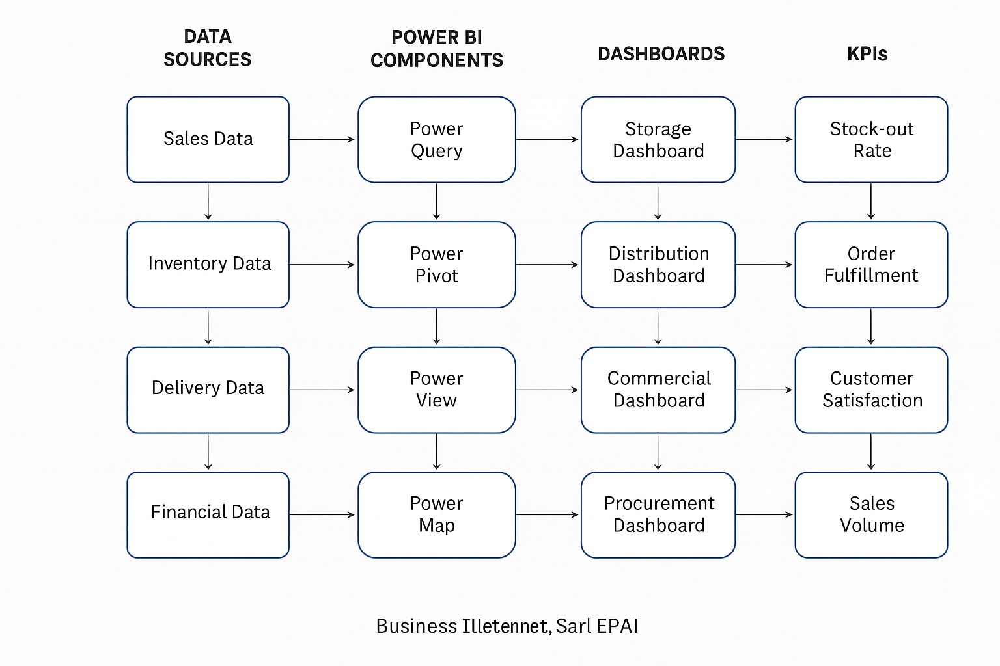
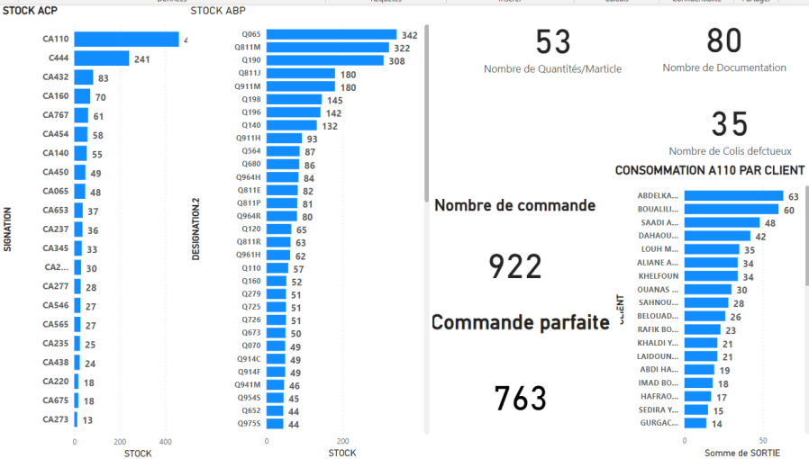
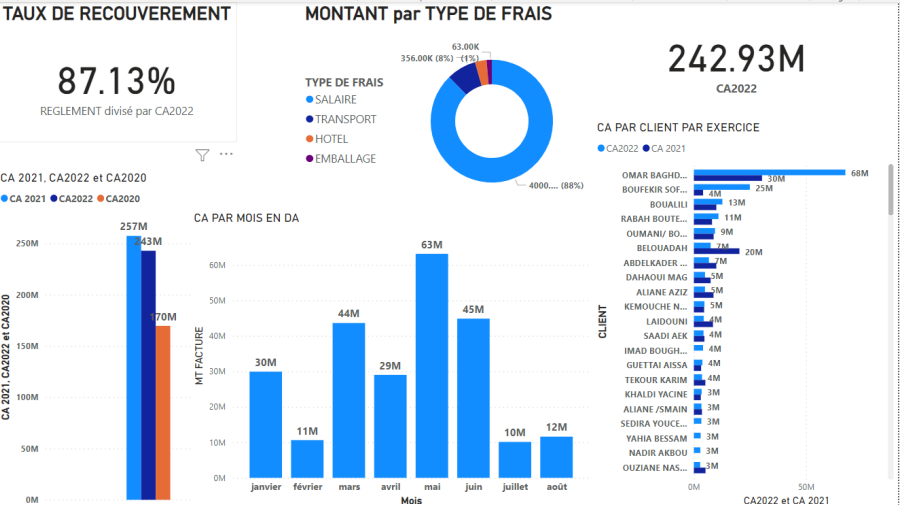
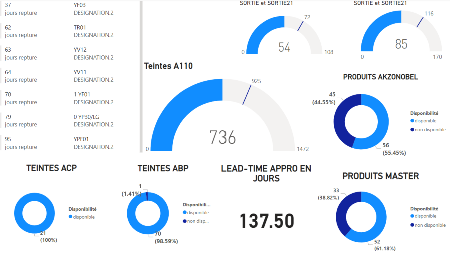

# Business Intelligence (BI) Solution to Optimize Logistics Performance in Import and Distribution



---

##  Project Overview
This project implements a **Business Intelligence (BI)** solution to optimize the **logistics performance** of a company specializing in **automotive parts import and distribution**.

Using **Microsoft Power BI**, I designed interactive dashboards that consolidate procurement, storage, distribution, and sales data — enabling managers to **track KPIs**, analyze performance, and make **data-driven decisions** in real time.

---

##  Objectives
- Develop dashboards for:
  -  **Procurement**
  -  **Stock & Distribution**
  -  **Commercial & Financial**
- Identify and monitor **Key Performance Indicators (KPIs)** such as:
  -  Stock-out Rate  
  -  Perfect Order Rate  
  -  Recovery Rate  
  -  Transport Cost
- Provide actionable insights for better decision-making and logistics efficiency.

---

##  Methodology
**Four-stage BI framework**

1. **Process Definition** – Map EPAI’s logistics workflows and objectives.  
2. **KPI Selection** – Define indicators per process.  
3. **Data Integration** – Clean & merge data from Excel / CIEL ERP with *Power Query*.  
4. **Dashboard Design** – Build interactive visual dashboards with *Power BI* tools.

**Power BI Components Used**
| Component | Function |
|------------|-----------|
|  Power Query | Data extraction & transformation |
|  Power Pivot | Data modeling & relationships |
|  Power View | Visualization & reporting |
|  Power Map | Geo-analysis of transport flows |

---

##  Results
-  4 fully functional dashboards created  
-  Reduced supply disruptions through KPI monitoring  
-  Improved visibility of stock and order accuracy  
-  Enhanced reporting for management and finance  

### Example Dashboards
| Department | Screenshot |
|-------------|-------------|
|  **Storage & Distribution** |  |
|  **Commercial** |  |
|  **Procurement** |  |

---

##  Main KPIs

| KPI | Description | Formula |
|------|--------------|----------|
| **Perfect Order Rate** | Accuracy & efficiency of order processing | `(Orders without error / Total orders) × 100` |
| **Stock-out Duration** | Days products are out of stock | `Days stock = 0` |
| **Recovery Rate** | Invoice payment efficiency | `(Amount recovered / Amount invoiced) × 100` |
| **Transport Cost** | Logistics cost per shipment | `Σ (Transport fees / Volume shipped)` |

---

##  Tools & Technologies
-  **Microsoft Power BI Desktop**  
-  **Microsoft Excel**  
-  **CIEL ERP** (data source)  
-  **CSV / SQL Exports**  
-  **Windows 10 / 11**

---


##  Outcomes & Future Work
### Achievements
-  Created a modular BI system adaptable to other companies.  
-  Enhanced logistics transparency and control.  

### Future Enhancements
-  Automate real-time data synchronization.  
-  Integrate predictive analytics & AI-based forecasting.  
-  Add sustainability / environmental KPIs.  

---

##  Repository Structure
```

.
├── /images/                 # All screenshots and flowchart images
│   ├── epai_bi_flowchart.png.png
│   ├── dashboard_storage.png
│   ├── dashboard_commercial.png
│   └── dashboard_financial.png
│
├── /data/                   # (Optional) anonymized sample data
├── /docs/                   # Thesis excerpts or PDF
└── README.md

```

---

